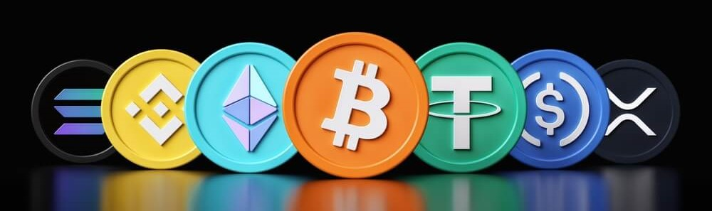

# Crypto Tracker
A searchable cryptocurrency price tracker app which renders in real-time the price, volume, change and market cap. project is designed to provide users with real-time information about various digital currencies, their rankings, and price fluctuations.

### 🌐 Features:

Real-time crypto prices

Sorting based on rankings

Visual representation of price fluctuations

